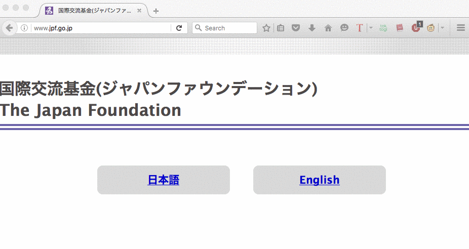
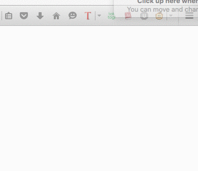

#Technical Product Report

###What did you build during this phase?
We build two different components, which internally were called "frontend" and "backend" (even that both have a presentation layer).

*This version was released under the tag "v0.1", which can be accessed [here](https://github.com/csc302-2016-spring/group5/tree/v0.1)*

#### "Frontend"

The idea was to implement the following steps:
  - User highlights a word (or a set of words/logograms)
  - User right-click the highlighted word(s)
  - User select a dictionary, which search result opens in a new tab

For this phase (phase 2), the dictionaries were hardcoded.

#### "Backend"

We created a very basic interface, where the user can add a dictionary. The idea is that dictionaries added through this interface are going to be accessible when right-clicking. However, it's not integrated with the Frontend yet.

###High-level design of your software.
Our web extension is comprised of two major parts, the user interaction component and the storage mechanism. Using the provided Chrome APIs, our extension captures text highlighted on web pages and gives possible dictionaries to search for definitions. The dictionaries are essentially URLs followed with search parameters (i.e q=, search=). The selected word and URL are concatenated together, followed by a redirection to the site in a new tab. The user can also store additional dictionaries by submitting a URL that follows the parameter restraints through our pattern filtering function. URLs themselves are stored in the local storage of the browser. 

###Technical highlights: interesting bugs, challenges, lessons learned, observations, etc.

One of the difficulties that we experienced throughout this phase was the lack of documentation regarding the development of Firefox add-ons. Although basic tutorials are provided, a lot of the more intermediate features we were trying to develop had a severe lack of resources. As a result, many of the features we developed were based on trial and error.

One example is the settings button that appears on the top right of the Firefox browser. There was little information regarding the implementation of the button and the customizability and its menu. Therefore, we experimented different methods within the add-on manifest file until we figured out how to get the settings button to show up and to customize it using HTML.

Another challenge that our group is experiencing is the implementation of whether a dictionary site added by the user is of sufficient format. Specifically, a user may set a website that is not an online dictionary to the add-on which may cause problems. Our challenge is to design a process to verify whether a user added site is indeed appropriate as a dictionary. We are still discussing and designing the implementation of this feature to showcase in the next phase.

One major issue that our group is facing is a security issue regarding our desired web page overlay feature. The initial design of our add-on was to have a word’s definition appear in an overlay. But implementing this causes security issues to arise. With displaying content in an overlay from another domain, we’re basically trusting that domain not to serve-up malware. So this causes security issues as the user is allowed to add dictionaries from any site they wish.

Thus, to overcome this we have to make the significant decision of whether to scrap the overlay feature. And if so, we will also need to either keep our current method or to design a new method of presenting a definition that is convenient and aesthetic for the user.

###What are your plans for the next phase?
We will need to connect and bind the custom dictionaries that the user enters and make it a selectable option upon right clicking. This will be considered as the minimal viable product as users can add their own custom dictionary.

if we have time, we also plan to have other additions on top of the minimal viable product. This includes quick add dictionary button when on a valid dictionary site, hot keys for quick search instead of right click, better GUI options page with more customization to allow ordering of entries.

###Reflect on your teamwork and process. What worked well, what  needs improvement.
We've been having the same format of short group meetings on Mondays to discuss the progress on the development of our add-on, and also to bring up issues that came up during our seperate devlopment phase, we then discuss the matter as a group to reach a consensus on how to solve those issues. We handle smaller technical issues and communication with a group chat online.

We split the development into the backend and frontend components and assign 3 members each to work on them, so far it has worked well in that we could split up the work evenly and allow members to focus on a smaller subset of problems, but at the same time, members that are not very familiar with the other part that they are not responsible for. Improvement can be made in that members of each position discuss their work with the members of the opposite group during our group meetings so they can understand the project as a whole better in order to formulate a big-picture understanding that is required for the integration of both parts in our final add-on.

[Link](https://docs.google.com/document/d/1tzzqHXFLxSxRMmB85BZm7GcnI4PymkBYQCtCnG2btMs/edit?usp=sharing) to meeting minutes

###Triage: What will you build for the final demo?
We will keep the main design of our add-on, having both the settings part and also the front-end part where users can highlight, right-click and select the dictionaries that they have stored. The both parts will be integrated to work as a single add-on, and users can expect to add any dictionary pages that support url query to look up their words.

We have experimented with putting the dictionary page redirect directly as a layover with the same page the user is browsing, however in addtion to the security issues mentioned above, we have also found that most dictionary sites are not formatted well under such a small layover area, the user has to scroll not only up-down but also left-right in order for them to browse all contents of the definition page. Because we think that the change to a layover-ui will decrease the overall user experience, we will decided to keep the displaying of the dictionary page in a seperate tab as in our previous demo, unless a more viable display option is discovered through our further experimentation.
